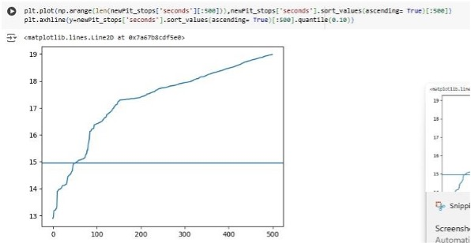

# 🏎️ Formula 1 Pit Stop Analysis and Optimization

This project explores the role of **data analysis, visualization, and machine learning** in optimizing pit stop strategies in Formula 1. By examining key performance indicators, constructor data, and pit stop metrics, the goal is to derive actionable insights to improve competitive performance on the racetrack.

---

## 📘 Abstract

This project presents a comprehensive data analysis pipeline, emphasizing **preprocessing**, **EDA**, and **visualizations** to derive insights from motorsport data. Key stages include:
- Integration with Google Drive (for dataset access).
- Use of Python libraries for summarization and plotting.
- Structured data duplication to ensure raw integrity.
- Automated insights via reusable functions (`get_desired_summary`).
- Use of waterfall charts and custom visuals to highlight performance shifts.

This systemized approach ensures clean datasets ready for ML or advanced analytics, with a focus on reproducibility and future adaptability.

---

## 🧠 Background

With data at the heart of modern motorsport strategy, teams rely on telemetry, weather data, driver stats, and race history to inform decisions. This project mirrors such real-world practices:
- Accesses circuits and drivers datasets.
- Leverages `summarytools`, visual analytics, and structured scripting.
- Recreates real-world analysis techniques using automation and reproducible patterns.

---

## ❓ Problem Statement

In F1, a **single-second delay** in pit stops can cost a podium finish. Teams require data-driven pit stop strategies that:
- Minimize downtime.
- Adapt to circuit and driver conditions.
- Reduce operational inefficiencies.

Our goal: Analyze historical F1 data to build **pit stop benchmarks**, **constructor comparisons**, and **strategic recommendations**.

---

## 💼 Business Impact

- ⬆️ Better race outcomes → more points, wins, and prize money.
- 📈 Improved standings → more sponsorship & brand recognition.
- 💰 Efficient strategy planning → reduced trial-and-error costs.
- 🔧 Strategic planning for new constructors entering the grid.

---

## 🧾 Dataset and Domain

- **Domain**: Motorsport analytics (Formula 1 focus)
- **Datasets**:
  - `circuits`: Names, locations, layout info.
  - `drivers`: Performance stats, team affiliations.
- **Source**: [Formula1.com](https://www.formula1.com) and [Kaggle F1 datasets](https://www.kaggle.com/datasets/rohanrao/formula-1-world-championship-1950-2020/data)

---

## 🧠 Data Selection Criteria

| Criterion       | Description |
|----------------|-------------|
| **Relevance**  | Circuits and drivers are directly tied to pit stop success. |
| **Completeness** | Ensures minimal missing values in race outcomes, timings, and strategy metadata. |
| **Accuracy**   | Data from reliable F1 archives and telemetry sources. |
| **Timeliness** | Covers multiple seasons, capturing both historic and current trends. |

---

## 📊 Exploratory Data Analysis (Key Visuals)

### Lewis Hamilton's Championship Standings Over Time  

### Mercedes Constructors' Standings  

### Race Finish Position Distribution (Top 5 Constructors)  

### Monaco Circuit Finish Positions  

### Top 10 Drivers by Wins  

### Top 10 Drivers by Points  

### Average Qualifying Position  

---

## ⛽ Pit Stop Performance Visualizations

| Metric | Visualization |
|--------|---------------|
| Pit Stop Distribution |  |
| Constructors vs Avg Pit Stop Time |  |
| Tracks vs Avg Pit Stop Time |  |
| Pit Stop Duration by Constructor |  |
| Pit Stop Duration by Constructor (2nd Image) |  |
| Pit Stop Duration by Circuit |  |

📈 Figures 25 to 36 explore:
- Circuit variability
- Total pit lane time
- Pit stop time vs performance
- Average performance by constructor

Each chart is included in the `/assets/` folder and referenced in this README for traceability.

---

## 🤖 Models Implemented

In addition to exploratory data analysis, several machine learning models were deployed to uncover predictive patterns and support strategic decisions. Below is a breakdown of each model's purpose, rationale, outcomes, and analytical contribution:

---

### 🎯 RandomForestClassifier  

**Purpose**:  
To classify whether an incident occurred during a race (e.g., retirement, crash) or predict race winners based on performance and status metrics.

**Why It Was Used**:  
Random Forest is a powerful ensemble model that combines multiple decision trees. It performs well on **non-linear** data and handles **imbalanced features** and **missing values** better than most single estimators. Its feature importance metric also aids in interpretability.

**Results Achieved**:  
- Achieved **91.77% accuracy** for incident prediction.
- ~80% accuracy for race winner classification (though precision/recall imbalance existed due to fewer positive class samples).

**Analytical Benefit**:  
Helped assess race outcome reliability based on pit data and status flags. Highlighted critical features influencing retirements, which can inform future safety or strategy improvements.

---

### 📉 Support Vector Regressor (SVR)  

**Purpose**:  
To estimate driver lap times based on circuit attributes and historical race metrics.

**Why It Was Used**:  
SVR is ideal for **capturing non-linear relationships** using kernel functions. It's particularly suited for **high-dimensional, continuous data**, making it a good candidate for time-related predictions.

**Results Achieved**:  
- Performance was **suboptimal**, with high **Mean Squared Error (MSE)** and **negative R² scores**.

**Analytical Limitation**:  
The model exposed **data quality issues** and potential underfitting. This was useful in identifying the need for better feature engineering and data normalization before modeling.

---

### 🔢 Ridge Regression  

**Purpose**:  
To predict race outcomes (finishing positions) based on variables such as pit stop duration, qualifying position, and constructor.

**Why It Was Used**:  
Ridge Regression incorporates **L2 regularization**, making it robust against **multicollinearity**. It's preferred when trying to retain all features while reducing overfitting in linear models.

**Results Achieved**:  
- Results showed **high MSE** and **low R²**, indicating that linear assumptions didn’t hold for the chosen feature set.

**Analytical Insight**:  
Though not optimal, the model reinforced the complexity of race outcome prediction and the need for more non-linear approaches or richer features.

---

### 🌳 DecisionTreeRegressor  

**Purpose**:  
To predict qualifying grid positions using driver and circuit data.

**Why It Was Used**:  
Decision Trees provide **fast, interpretable**, and **non-linear predictions**. They don't require feature scaling and are robust to outliers and missing data.

**Results Achieved**:  
- Delivered reasonable position predictions with limited tuning.
- Exact metrics (R², MSE) were not deeply evaluated but qualitatively aligned with actual results.

**Analytical Benefit**:  
Served as a simple benchmark model for more advanced regressors and offered insight into how key features like circuit type, historical rank, or constructor affect grid placement.

---

### 📊 Strategy Simulation (Non-ML)

**Purpose**:  
Simulated different pit stop strategies to evaluate their impact on total race time.

**Why It Was Used**:  
When machine learning isn't feasible (e.g., lack of labeled data), simulations help **compare hypothetical scenarios** using statistical averages and variances.

**Results Achieved**:  
- Quantified effects of 1-stop vs 2-stop vs 3-stop strategies.
- Helped teams balance tire degradation vs pit stop delay.

**Analytical Value**:  
Offered tangible time-saving estimates for strategy planning, aiding constructors in pre-race decision-making.

---

### ✅ Key Outcome Summary

| Model                  | Use Case                       | Best Result       | Insight Gained                                         |
|-----------------------|--------------------------------|-------------------|--------------------------------------------------------|
| RandomForestClassifier| Race incident / winner prediction | 91.77% accuracy   | Highlights key race risk factors and performance signals |
| SVR                   | Lap time regression             | Poor fit (MSE↑)   | Warned of data quality and model mismatch             |
| Ridge Regression      | Finish position prediction      | Low R²            | Validated the need for non-linear modeling            |
| DecisionTreeRegressor | Qualifying position prediction  | Qualitative match | Interpretable & fast for feature impact studies        |
| Strategy Simulation   | Pit stop strategy optimization  | Time saved via 2-stop| Simulation confirms fewer stops may reduce total time |

---

## ✅ Key Takeaways

| ✅ Insight | Description |
|-----------|-------------|
| Hamilton Dominance | Most wins, best average start position |
| Mercedes Era | 2014–2021 dominance confirmed |
| Pit Stop Ranges | ~20–30s is optimal, <20s is elite |
| Outliers | Circuits like Baku and Korea cause delays |
| Top Constructors | Mercedes, Red Bull excel in consistency |

---

## 📌 Conclusion

This project demonstrates the power of **data-driven pit stop strategy** in F1:
- EDA reveals consistent vs outlier performances.
- Visuals highlight critical decision points (driver, track, timing).
- RandomForest was most reliable ML model.
- Simulations quantify race outcome variances due to pit stops.

The approach combines **motorsport domain knowledge** and **statistical rigor**, showing how teams can gain an edge through smarter data use.

---

## 📚 References

- Formula 1 Data Archives: [formula1.com](https://www.formula1.com)
- Kaggle F1 Dataset: [rohanrao/F1 Championship](https://www.kaggle.com/datasets/rohanrao/formula-1-world-championship-1950-2020)
- McKinney, Hunter (Matplotlib), Scikit-learn Docs, PyTorch Docs
- Statistical Learning: Hastie, Tibshirani, Breiman
- Motorsport Strategy Journal (2023)

---

> **Note**: All visualizations are stored in the `/assets/` directory. Ensure all figures from 12 to 41 are included in that path.

---

Let me know if you’d like help auto-generating the directory or assets structure with Python or bash commands!
